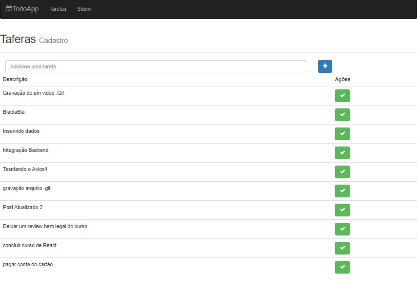

# todo-app-with-redux

<h1 align="center">
 

 
 
GitHub @ViannaAandreBR
</h1>

A little description about our project

  

## Features
[//]: # (Add the features of your project here:)
This app features all the latest tools and practices in mobile development!

- ⚛️ **React Js** — A JavaScript library for building user interfaces
- ⚛️ **React Native** — A lib that provides a way to create native apps for Android and iOS
- 💹 **Node Js** — A web framework for Node Js

## Getting started - Backend

/backend/npm run dev

/backend/npm run production

## Getting started - MongoDB

/frontend/mongod

## Getting started - Frontend

/frontend/npm run dev

/frontend/npm run production

## License

This project is licensed under the MIT License - see the [LICENSE](https://opensource.org/licenses/MIT) page for details.
Copy link